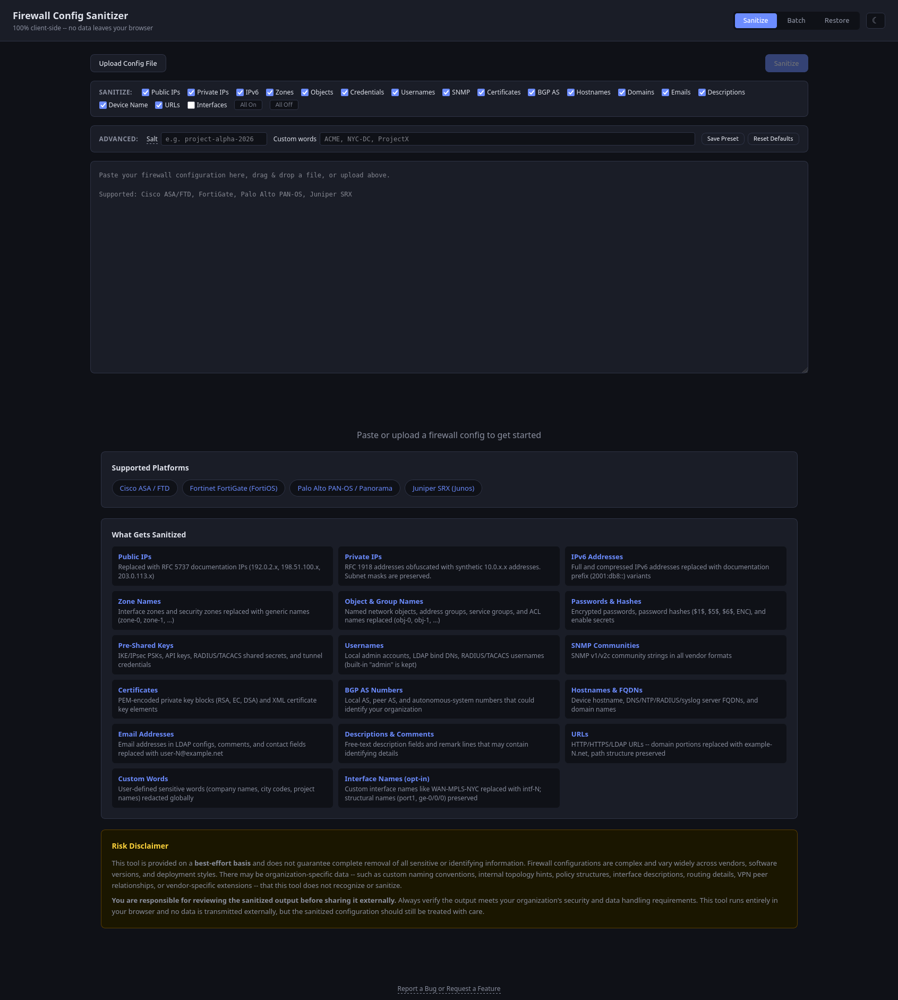

# Firewall Config Sanitizer

A portable, browser-based tool that sanitizes firewall configurations by replacing sensitive and identifiable information with safe placeholders. Runs 100% client-side — no data leaves your machine.

## Usage

1. Download `index.html`
2. Open it in any modern browser
3. Accept the risk disclaimer
4. Paste, upload, or drag-and-drop a firewall config
5. Toggle sanitization categories on/off as needed
6. Optionally set a **salt** for deterministic output and/or add **custom sensitive words**
7. Click **Sanitize**
8. Review the **validation warnings** for any potentially missed items
9. Use the **Diff** view to compare original vs sanitized side-by-side
10. Download the **sanitized config** (safe to share) and the **mapping file** (to restore later)

For multiple files, use the **Batch** tab to sanitize several configs at once and download a zip.

## What Gets Sanitized

Each category can be individually enabled or disabled via checkboxes before sanitizing.

| Category | Replacement |
|----------|-------------|
| Public IPs | RFC 5737 documentation IPs (`192.0.2.x`, `198.51.100.x`, `203.0.113.x`) |
| Private IPs | Prefix-preserving `10.x.x.x` addresses |
| IPv6 addresses | RFC 3849 documentation prefix (`2001:db8::`) |
| Zone names | `zone-0`, `zone-1`, ... |
| Object / group names | `obj-0`, `obj-1`, ... |
| Passwords & hashes | `REDACTED_HASH_N` |
| Pre-shared / API keys | `REDACTED_KEY_N` |
| Usernames | `user-0`, `user-1`, ... |
| SNMP communities | `REDACTED_COMMUNITY_N` |
| Certificates | `REDACTED_CERT_N` |
| BGP AS numbers | `REDACTED_BGP_N` |
| Server hostnames | `host-N.example.net` |
| Device hostname | `sanitized-fw` |
| Domain names (FQDNs) | `example-N.net` |
| Email addresses | `user-N@example.net` |
| URLs | Domain replaced with `example-N.net`, path preserved |
| Interface names (opt-in) | `intf-0`, `intf-1`, ... (structural names like port1, ge-0/0/0 preserved) |
| Descriptions & comments | `SANITIZED_DESC_N` |
| Custom words | `REDACTED_WORD_N` |

CIDR prefix lengths (e.g. `/24`, `/32`) are preserved alongside their replaced IP addresses.

## Features

- **Prefix-preserving IP anonymization** — IPs sharing a subnet stay in the same subnet after anonymization (e.g. two hosts on the same /24 remain on the same /24)
- **Deterministic salt** — provide an optional salt so the same config always produces the same output; enables processing HA pairs separately with compatible results
- **Custom sensitive word list** — add comma-separated org-specific terms (company name, city codes, project names) to redact globally
- **Batch mode** — sanitize multiple config files at once with the same salt and options; downloads a zip with all sanitized files and a combined mapping. Auto-generated salts are displayed in the stats bar for recording
- **Interface name sanitization** — opt-in category to replace topology-leaking interface names (WAN-MPLS-NYC) while preserving structural ones (port1, ge-0/0/0)
- **Drag-and-drop upload** — drop a config file directly onto the text area
- **URL sanitization** — HTTP/HTTPS/LDAP/FTP URLs have their domain replaced while preserving path and port
- **Selective sanitization** — toggle each category on/off via checkboxes
- **Save/load presets** — save your checkbox settings, salt, and custom words to localStorage for reuse
- **Diff view** — side-by-side comparison of original vs sanitized config with changed lines highlighted
- **Validation warnings** — post-sanitize scan flags potential missed items (IPs, emails, FQDNs, URLs, password hashes, IPv6)
- **Copy mapping as CSV** — export the mapping table in spreadsheet-friendly format
- **Config size indicator** — shows line/size count, warns if config appears incomplete
- **Light/dark mode** — toggle in the upper right, preference persisted
- **Mobile responsive** — works on tablets and phones
- **Restore** — upload a sanitized config + mapping file to reconstruct the original

## Supported Vendors

Vendor is auto-detected and only the relevant sanitization rules are applied, reducing false positives and improving performance. Unrecognized configs run all rules in best-effort mode.

- Cisco ASA / FTD
- Fortinet FortiGate (FortiOS)
- Palo Alto PAN-OS / Panorama
- Juniper SRX (Junos)

## Restoring a Config

1. Switch to the **Restore** tab
2. Upload the sanitized config and its `.mapping.json` file
3. Click **Restore Original Config**
4. Download the restored config

## Mapping File

The mapping file is a JSON document containing every replacement made during sanitization. Keep it secure — it contains the original sensitive values needed to reverse the sanitization. If a salt was used, it is recorded in the mapping file metadata.
